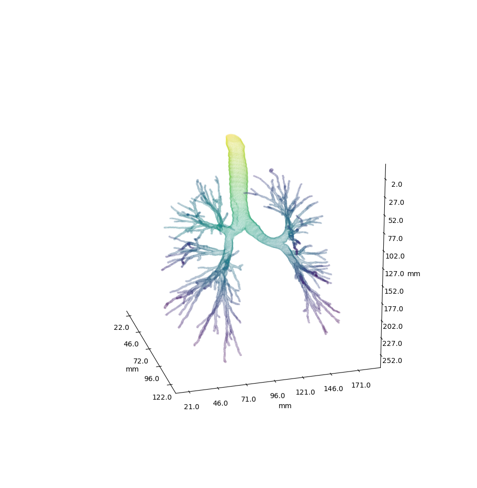
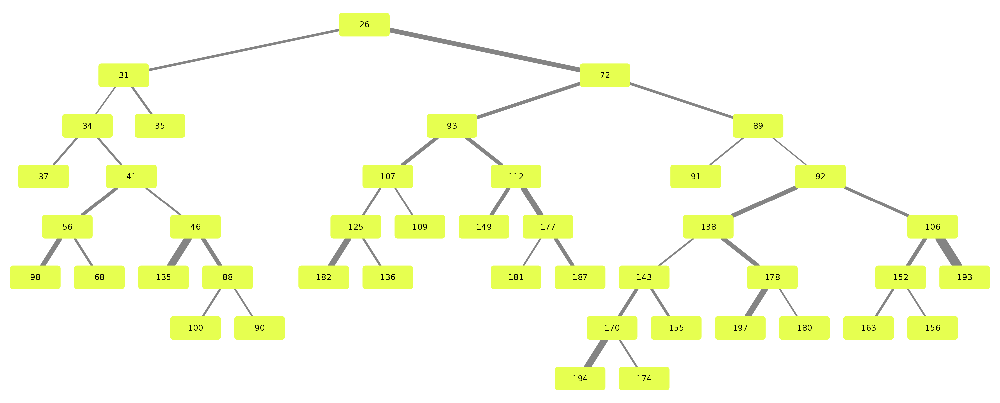

# Airway

Airway is a project which analyses the layout of lung bronchus 

## How to work with the data?

We use a pipeline based approach to calculate the raw data. With the help of
`airway-pipeline.py` you are able to calculate each step (called stages) separately or
all at once.

Everything happens in a directory of your choice. Prerequisites are the
raw data and the filesystem structure of the raw data. Maybe the
`seperate-bronchus-files.sh` script can help you.

    SOMEDIR 
          |
        raw_airway
                |
                PATIENT_ID
                        |
                        Bronchus
                        RightUpperLobe
                        RightMiddleLobe
                        RightLowerLobe
                        LeftUpperLobe
                        LeftLowerLobe

For every calculated stage `airway-pipeline` creates a new directory (stage-xx) and subdirectories for each patient (e.g. 1234567):

    SOMEDIR
          |
          stage-xx
                 |
                 1234567
                 1234568
                 .
                 .
                 .

Let us calculate stage 1:

`airway-pipeline -p /FULL/PATH/TO/SOMEDIR -s 1`

airway-pipeline checks if the stage is already existing, if you need to overwrite
a stage you need to add the `-f` flag.

If you want more than one stage use the following syntax:

`airway-pipeline -p /FULL/PATH/TO/SOMEDIR -s 1 -s 2 -s 4 -s 3`

By default four patients will be calculated in parallel (4 workers are used). If you have more cpu cores,
simply increase the number of workers:

`airway-pipeline -p /FULL/PATH/TO/SOMEDIR -s 1 -s 2 -w 32` 

## What do the stages mean?

Stages 1 through 9 are responsible for generation of the bronchus tree splits.

Stage 10 through 19 are responsible for tree analysis.

Stages 20 through 29 are responsible for visualisation.

## Example trees for patient 3183090

